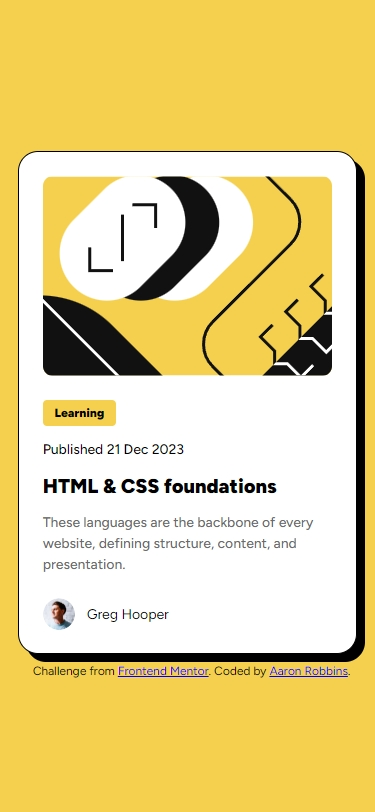
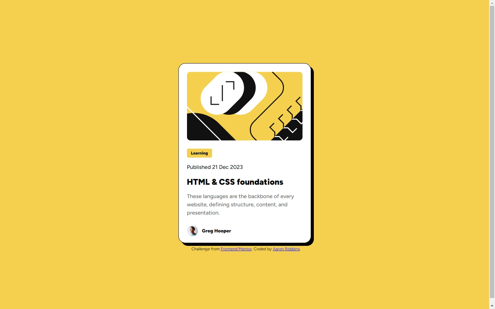

# Frontend Mentor - Blog preview card solution

This is a solution to the [Blog preview card challenge on Frontend Mentor](https://www.frontendmentor.io/challenges/blog-preview-card-ckPaj01IcS). Frontend Mentor challenges help you improve your coding skills by building realistic projects.

## Table of contents

- [Overview](#overview)
  - [The challenge](#the-challenge)
  - [Screenshot](#screenshot)
  - [Links](#links)
- [My process](#my-process)
  - [Built with](#built-with)
  - [What I learned](#what-i-learned)
  - [Continued development](#continued-development)
  - [Useful resources](#useful-resources)
- [Author](#author)
- [Acknowledgments](#acknowledgments)

## Overview

### The challenge

Users should be able to:

- See hover states for all interactive elements on the page.
- See responsive elements using different screen sizes.

### Screenshot




### Links

- Solution URL: [Add solution URL here](https://your-solution-url.com)
- Live Site URL: [Add live site URL here](https://your-live-site-url.com)

## My process

### Built with

- Semantic HTML5 markup
- Flexbox
- CSS
- Mobile-first workflow

### What I learned

I learned that clamp is a cool way to design responsive websites, but I'm still not totally familiar with calculating the proper values to get the kind of results I want. At least initally, media queries still are my preference, but clamp is certainly more concise.

Below is some code that reflects the things I learned above:

```html
<section class="blog-description">
  <div class="blog-category-container">
    <p class="blog-category text-preset-3-bold">Learning</p>
  </div>
  <p class="date text-preset-3">Published 21 Dec 2023</p>
  <p class="blog-title text-preset-1 content-margin">HTML & CSS foundations</p>
  <p class="blog-subtitle text-preset-3">
    These languages are the backbone of every website, defining structure,
    content, and presentation.
  </p>
</section>
```

```css
.text-preset-1 {
  font-weight: 900;
  font-size: clamp(1.25rem, 0.75rem + 2vw, 1.5rem);
}

.text-preset-2 {
  font-weight: 500;
  font-size: clamp(0.875rem, 0.5vw + 0.75rem, 1rem);
}

.text-preset-3 {
  font-weight: 500;
  font-size: clamp(0.75rem, 0.5vw + 0.75rem, 1rem);
}

.text-preset-3-bold {
  font-weight: 900;
  font-size: 0.75rem;
}
```

### Continued development

This challenge really tested my patience and my nitpicking. Especially as I continue to produce projects, I want to learn how to develop my CSS layout quickly and effectively, while trying to get my rendition "close enough", not focusing on every pixel difference.

I did have to use media queries for a couple elements, but clamp is definitely a new animal for me. I want to practice clamp more and learn how to more effectively choose values.

### Useful resources

I used the following resources to learn how clamp works and to nail down my values

- [raybo.org](https://raybo.org/posts/2021-02-28-CSS%20Clamp/)
- [MakeMyChance](https://makemychance.com/css-clamp/)
- [Claude AI](https://claude.ai/)

I continue to use Responsively to look at my designs on various screen sizes and to take screenshots.

- [Responsively App](https://responsively.app/)

## Author

- GitHub - [Aaron Robbins](https://github.com/FREExM1ND)
- Frontend Mentor - [@FREExM1ND](https://www.frontendmentor.io/profile/FREExM1ND)

## Acknowledgments

I'm thankful for the team at Responsively for creating a useful development tool. Thank you to Frontend Mentor for the challenge. I'm eager to do more.
